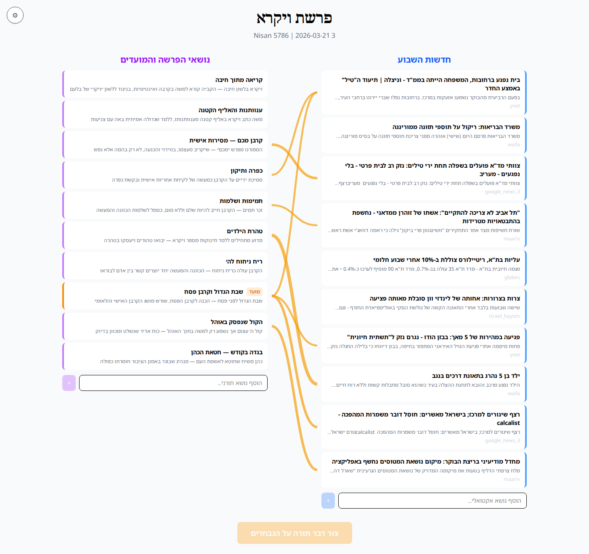
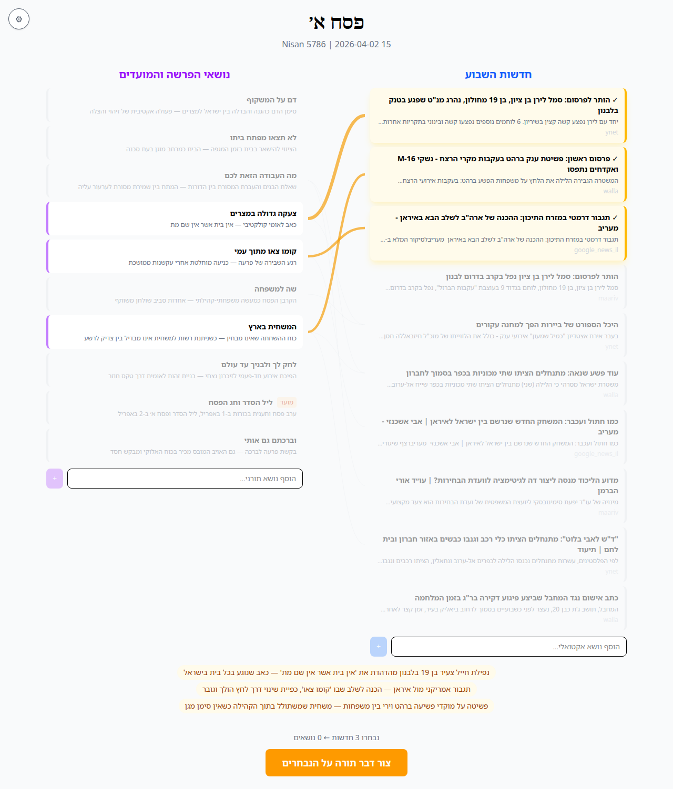
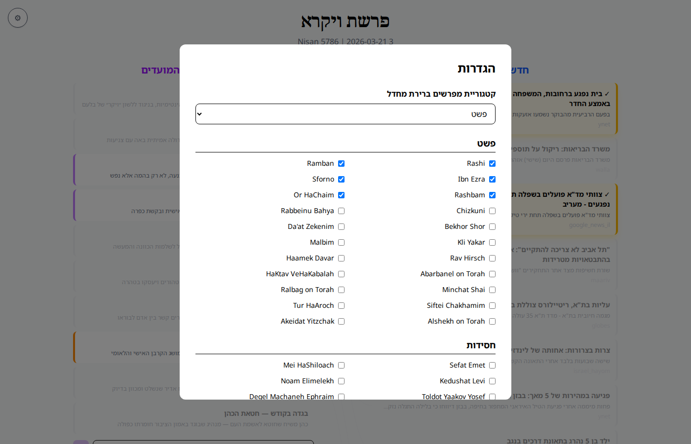

<p align="center">
  
</p>

# סבא יוסף — Saba Yosef | Dvar Torah Agent

סוכן שבועי להכנת דבר תורה לשבת. מחבר בין אקטואליה ישראלית לפרשת השבוע דרך מפרשים — הכל בעברית.


## מה זה עושה?

כל יום חמישי, הסוכן:
1. **אוסף חדשות** מ-6 מקורות ישראליים (Ynet, Walla, Google News, מעריב, גלובס, ישראל היום)
2. **מוריד את פרשת השבוע** מ-Hebcal + טקסט ומפרשים מ-Sefaria
3. **מזהה מועדים יהודיים** קרובים (חגים, צומות, ראש חודש)
4. **מנתח קשרים** בין החדשות לנושאי הפרשה באמצעות Claude

ואז המשתמש:
1. רואה **מפת קשרים אינטראקטיבית** — חדשות בצד ימין, נושאי פרשה בצד שמאל, קווי חיבור ביניהם
2. בוחר נושאים מעניינים משני הצדדים (או מוסיף נושאים חופשיים)
3. מקבל **5 הצעות לדבר תורה** עם מקורות ממפרשים
4. עורך את דבר התורה ב**עורך טקסט עשיר** עם צ'אט AI
5. מייצר **דף מקורות PDF** להדפסה

## צילומי מסך

### מפת קשרים אינטראקטיבית
חדשות בצד ימין, נושאי פרשה ומועדים בצד שמאל, קווי SVG מחברים ביניהם:



### בחירת נושאים
לחיצה על חדשות/נושאים מדגישה קשרים ומעממת את השאר:



### הגדרות מפרשים
60+ מפרשים ב-5 קטגוריות — פשט, חסידות, מוסר, מדרש, ביקורת המקרא:



## ארכיטקטורה

```
backend/          Python 3.12+ / FastAPI / SQLite
├── collectors/   RSS news + Hebcal + Sefaria API
├── ai/           Claude CLI wrapper + Hebrew prompts
├── pdf/          WeasyPrint → דף מקורות PDF
└── cron/         Thursday auto-collection

frontend/         React 18 / TypeScript / Vite / Tailwind
├── ConnectionDashboard   מפת קשרים SVG אינטראקטיבית
├── SuggestionCards       הצעות עם streaming text
├── Editor/               Tiptap RTL + צ'אט AI
└── PdfPreview            תצוגה מקדימה והורדה
```

## התקנה

### דרישות מקדימות
- Python 3.12+
- Node.js 18+
- [Claude Code CLI](https://docs.anthropic.com/en/docs/claude-code) מותקן ומחובר
- WeasyPrint system deps: `sudo apt install libpango-1.0-0 libpangocairo-1.0-0 libcairo2 libgdk-pixbuf2.0-0`

### Backend

```bash
cd backend
python -m venv .venv
source .venv/bin/activate
pip install -e ".[dev]"
```

### Frontend

```bash
cd frontend
npm install
```

## הפעלה

### הפעלה מהירה

```bash
./scripts/run-server.sh
# Backend: http://localhost:8085
# Frontend: http://localhost:5173
```

### התקנת Cron (אוטומטי כל יום חמישי 08:00)

```bash
./scripts/install-cron.sh
```

### הפעלה ידנית של איסוף נתונים

```bash
cd backend
source .venv/bin/activate
python -m cron.weekly_prep
```

## מפרשים זמינים

60+ מפרשים ב-5 קטגוריות:

| קטגוריה | מפרשים |
|---------|--------|
| **פשט** | רש"י, רמב"ן, אבן עזרא, ספורנו, רשב"ם, אור החיים, חזקוני, רבינו בחיי, בכור שור, דעת זקנים, כלי יקר, מלבי"ם, רש"ר הירש, העמק דבר, אברבנאל, הכתב והקבלה, מנחת שי, רלב"ג, שפתי חכמים, טור הארוך, אלשיך, עקידת יצחק |
| **חסידות** | שפת אמת, מי השילוח, קדושת לוי, נועם אלימלך, תולדות יעקב יוסף, דגל מחנה אפרים, מאור ושמש, אוהב ישראל, תפארת שלמה, בת עין, ליקוטי מוהר"ן, פרי צדיק, זרע קודש, אור המאיר, ישמח משה, בן פורת יוסף, אגרא דכלה |
| **מוסר** | עקידת יצחק, שני לוחות הברית, אלשיך, קב הישר, ראשית חכמה, רבינו בחיי, רקנאטי |
| **מדרש** | תנחומא, תנחומא בובר, ויקרא רבה, שמות רבה, במדבר רבה, מדרש אגדה, ספרא, ילקוט שמעוני, זוהר |
| **ביקורת המקרא** | שד"ל, דוד צבי הופמן, רג'יו |

## מקורות חדשות

| מקור | סוג |
|------|-----|
| Ynet | RSS |
| Walla | RSS |
| Google News IL | RSS (מאגד) |
| מעריב | RSS |
| גלובס | RSS (כלכלה) |
| ישראל היום | RSS |

## API

| Endpoint | Method | תיאור |
|----------|--------|-------|
| `/api/health` | GET | בדיקת תקינות |
| `/api/parasha/current` | GET | פרשה נוכחית + חדשות + נושאים + קשרים |
| `/api/settings/profile` | GET/PUT | העדפות מפרשים |
| `/api/dvar-tora/suggestions/{id}/stream` | GET | SSE — יצירת הצעות עם streaming |
| `/api/dvar-tora/expand/{id}/stream` | GET | SSE — כתיבת דבר תורה מלא עם streaming |
| `/api/dvar-tora/{id}` | GET/PATCH | קריאה/עדכון דבר תורה |
| `/api/dvar-tora/chat` | POST | עריכה באמצעות AI |
| `/api/pdf/{id}` | GET | הורדת דף מקורות PDF |

## טכנולוגיות

- **Backend:** Python, FastAPI, SQLModel, SQLite, httpx, feedparser, BeautifulSoup, WeasyPrint, Jinja2
- **Frontend:** React, TypeScript, Vite, Tailwind CSS, Tiptap, marked
- **AI:** Claude CLI (ללא API key)
- **Data:** Sefaria API, Hebcal API, RSS feeds
- **PDF:** WeasyPrint עם תבנית HTML/CSS בעברית RTL

## מבנה הפרויקט

```
dvar-tora/
├── backend/
│   ├── app/
│   │   ├── main.py              # FastAPI entry point
│   │   ├── models.py            # SQLModel models
│   │   ├── database.py          # SQLite engine
│   │   ├── api/                 # REST endpoints
│   │   ├── collectors/          # News + Parasha + Mefarshim
│   │   ├── ai/                  # Claude CLI wrapper + prompts
│   │   └── pdf/                 # PDF generator + templates
│   ├── cron/
│   │   └── weekly_prep.py       # Thursday auto-collection
│   └── tests/                   # 21 tests
├── frontend/
│   └── src/
│       ├── components/
│       │   ├── ConnectionDashboard.tsx  # Interactive connection map
│       │   ├── SuggestionCards.tsx      # AI suggestions with streaming
│       │   ├── Editor/                 # Tiptap editor + chat
│       │   ├── Settings.tsx            # Mefarshim preferences
│       │   └── PdfPreview.tsx          # PDF preview
│       └── lib/
│           ├── api.ts                  # API client with SSE
│           └── types.ts                # Shared types
├── scripts/
│   ├── run-server.sh            # Start both servers
│   └── install-cron.sh          # Install Thursday cron
└── docs/
    └── superpowers/
        ├── specs/               # Design documents
        └── plans/               # Implementation plans
```

## רישיון

MIT
